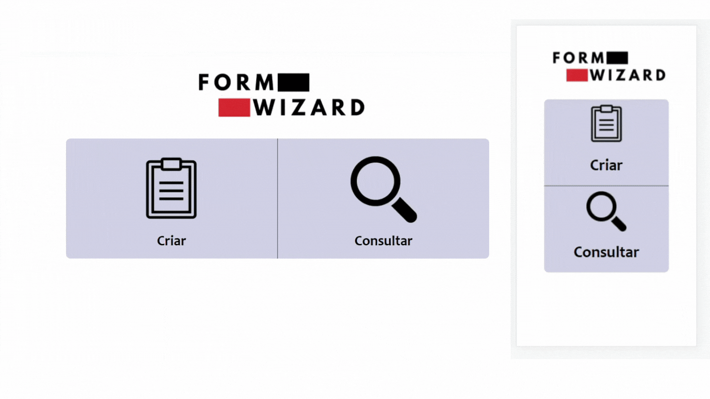

    
    <h3>Practical, fast and easily editable form wizard for surveys❕📝</h3>
    

        <a href="#overview">Overview</a> •
         <a href="#getting-started">Getting Started</a> • 
        <a href="#features">Features</a> • 
        <a href="#preview">Preview</a> • 
        <a href="#references">References</a> • 
        <a href="#author">Author</a>
    

#

# Overview
With the form wizard are able to do online researches. This application allows you to capture digital signatures, view files in PDF format for mobiles and generate documents in this format.

# Getting Started
Follow this project's template, pay attetion to the comments. All the libraries you need are already in it. Create a database to send the collected data with the technology of your choice (I used PostgreSQL for example). I recommend that you use the FormData() constructor to capture the values ​​from the HTML form (in assets/js/script.js contains an example...). Any question contact me. 

# Features

- Signature Capture;
- View PDF files in mobile;
- Generate PDF files;

# References
-> HTML to PDF converter <strong>Dompdf</strong>:
"https://github.com/dompdf/dompdf";

-> A <strong>jQuery UI plugin</strong> that captures or draws a signature:
"http://keith-wood.name/signature.html"

-> A general-purpose, web standards-based platform for parsing and rendering PDFs, <strong>PDF.js</strong>:
"https://mozilla.github.io/pdf.js/"

# Preview

<h3>https://hqt-formwizard.netlify.app</h3>

# Author

 
<strong>Héctor Queiroz Torres</strong>
 
I hope this tool helps with your research. 🚀👋🏽

  

